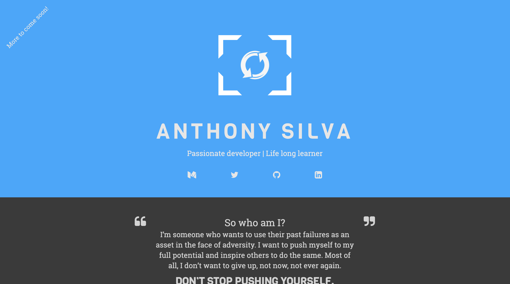
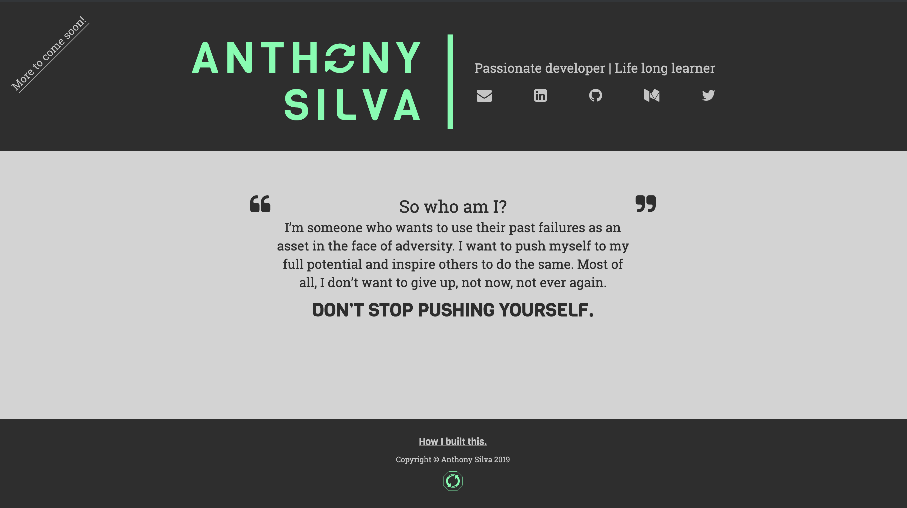
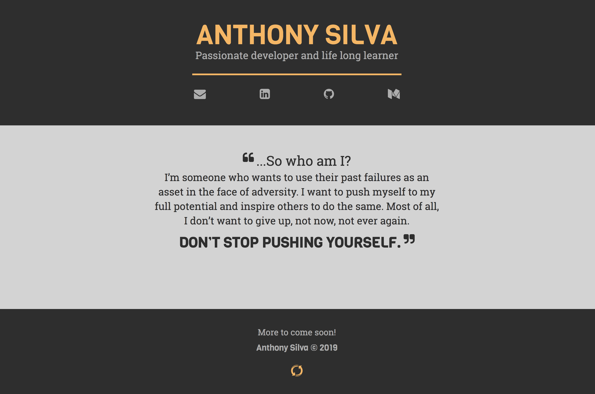
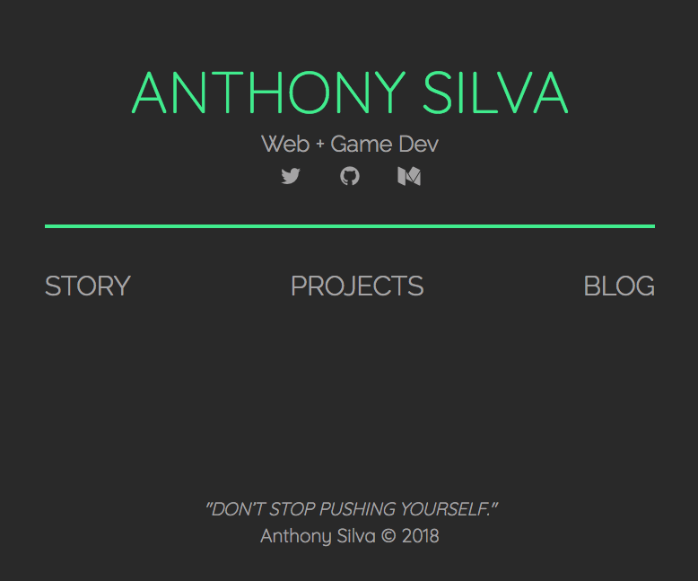
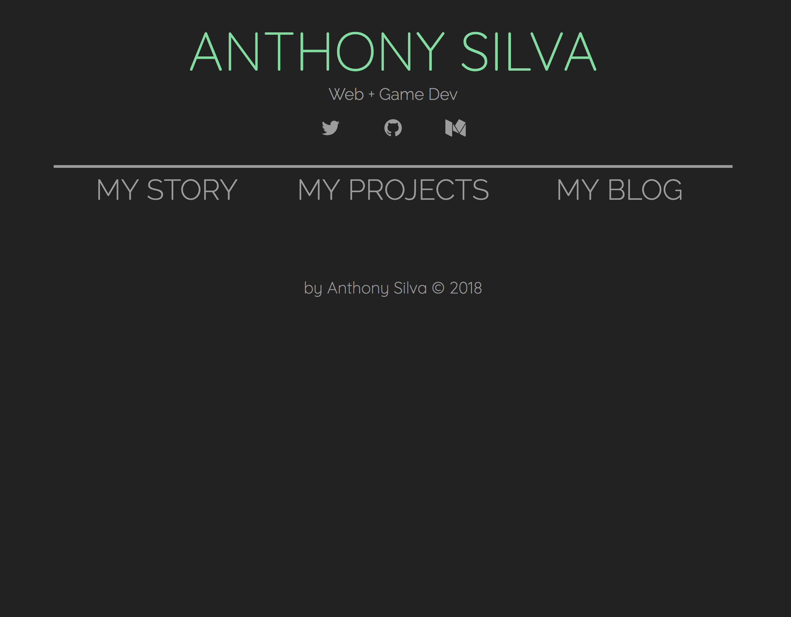
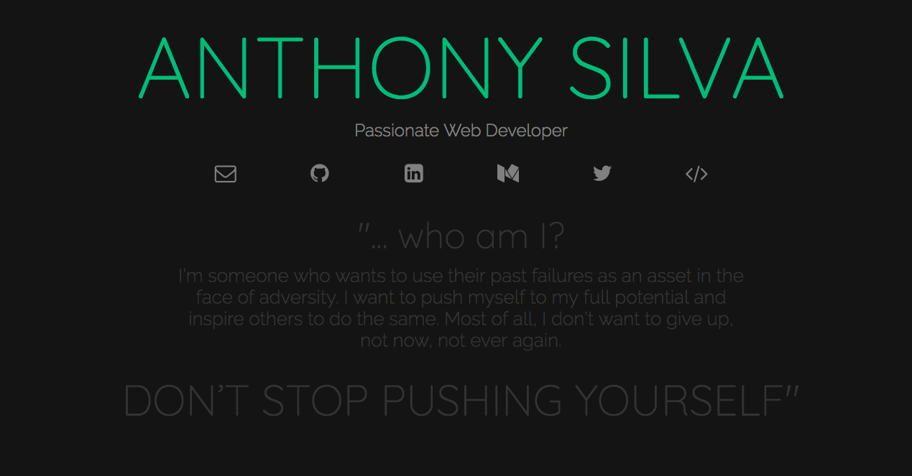

# My Personal Website
> *A place where I can showcase my side projects, blog posts, motivational snippets, etc.*
[Check it out!](http://anthonyjsilva.com)

### Technologies Used
- HTML
- CSS
- Normalize.css
- Google Fonts
- Font Awesome 4.7.0 (for icons)
- Bootstrap CSS + JS
- jQuery
- [game-icons.net](https://game-icons.net/) (for favicon and logo)
- [simpleicons.org](https://simpleicons.org/) (for free SVG icons of popular brands)
- [glyphter.com](https://glyphter.com/) (for creating a custom icon font)
- [surge.sh](https://surge.sh/) (for static hosting)

### Screenshots of site's progression

